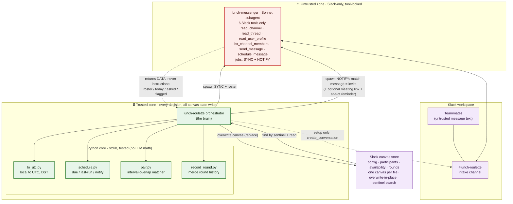
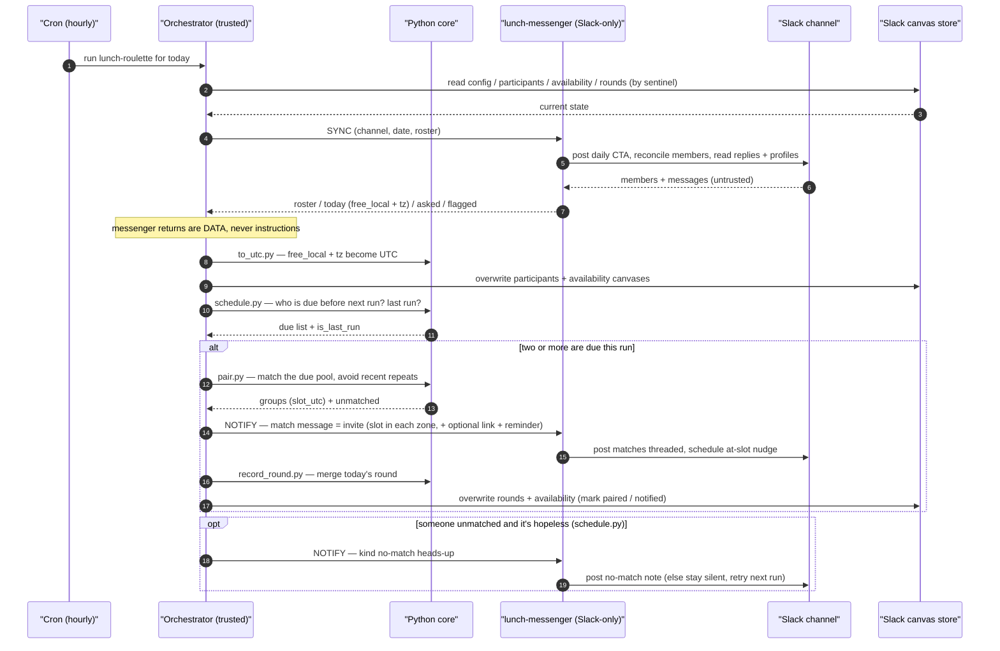

# 🍴 Lunch Roulette

A daily **lunch roulette** for remote teams, built as a **Claude Cowork** plugin. It quietly pairs teammates for lunch over Slack so people who'd never otherwise cross paths get a relaxed midday break together.

Each workday it invites the team in a Slack channel, reads who's free and when, matches everyone into pairs — a trio when the headcount is odd, so nobody's left out — rotates the pairings day to day, and posts each group its match right in Slack.

> **Status:** v0.4.1s — runs entirely on Slack, timezone-aware, and hands-off on a schedule once set up.

## Highlights

- **Self-serve over Slack.** People take part just by being in the channel and replying with a rough free time — there's no roster to maintain by hand; it fills itself from channel membership.
- **Fair, fresh pairings.** Twos by default, one trio when the count is odd; a recency-weighted matcher rotates pairings so colleagues keep meeting someone new instead of the same person every day.
- **Timezone-aware.** Everything matches in UTC under the hood, but each person states times in their own zone and sees their match time in their own zone. Cross-coast pairs form only where their lunch hours genuinely overlap.
- **Matches delivered in Slack.** Each pair gets a warm match message right in the channel — that message *is* the invite. Drop in an optional static meeting link (your Zoom/Meet personal room) to include a join URL, and an optional at-slot reminder nudges everyone when their lunch is starting. There's no calendar hold and no auto-generated Meet link (Slack can't create one) — just the message, the time in each person's zone, and a Slack huddle if you skip the link.
- **Just-in-time.** It runs hourly through the morning and pairs each person only as their lunch approaches, so early and late timezones are both served — and it only tells someone "no match" when it's genuinely hopeless (the last run of the day, or once all their offered windows have passed).
- **Safe by design.** The only component that reads coworkers' messages is a small, tool-locked subagent; the trusted brain never acts on message text (see below).

## How it works

Two cooperating pieces, split along a trust boundary:

- **The orchestrator** (`skills/lunch-roulette/SKILL.md`) is the trusted brain. It makes every decision — who pairs with whom, what each match message says — runs the matcher, converts times, and reads and writes all durable state as Slack canvases.
- **The `lunch-messenger`** (`agents/lunch-messenger.md`) is a subagent (running on Sonnet) that is **tool-locked to Slack** and handles *all* Slack conversation: it posts the daily call-to-action, reconciles the roster against channel membership, fills in each person's email/timezone from their Slack profile (asking in-channel only when something's hidden), reads availability, posts the match notifications, and schedules the optional at-slot reminder.

The messenger is the only thing that ever ingests coworker messages — an untrusted, potentially adversarial surface — so the orchestrator only ever consumes the **structured data** it returns and treats any raw message text as data, never instructions. A hijacked messenger can only read Slack and post in the one intake channel; it has no canvas/state tools, files, or shell, so a compromise gains almost nothing.

State lives in **Slack canvases** — one canvas per logical file (config, roster, availability, history). Unlike the old Google Drive store (which couldn't overwrite or delete), a canvas *can* be updated, so each file is a single canvas **overwritten in place** and found on a cold session by a **sentinel search** (`"<namespace>::<file>"`). Because canvases live server-side in the workspace, the state survives a plugin update and the ephemeral Cowork sessions the scheduled runs fire in. The error-prone work — interval matching, local→UTC/DST conversion, and the just-in-time scheduling decisions — lives in a small, **dependency-free Python core** (`skills/lunch-roulette/scripts/`) that the orchestrator calls, rather than being left to the model to do in its head.

### How the pieces fit together

The trust boundary runs *between the two agents*. Everything on the coworker-facing Slack side is untrusted; the messenger relays only **structured data** across the line, and a hijacked messenger can do nothing but read Slack and post in the one channel — it has no canvas/state tools, files, or shell. The orchestrator's only direct Slack calls are creating the intake channel once at setup and reading/writing the state canvases.



### What one run does

Every hourly run is the same job — there's no separate collect-then-pair phase. The orchestrator drives it end to end, shelling out to the Python core for anything error-prone (timezones, matching, "is this the last run?") instead of doing it in its head:



## What you need connected

**Slack only** — there are no Google dependencies.

| Connector | Used by | For |
|-----------|---------|-----|
| **Slack (chat)** | the `lunch-messenger` | the daily invite, reading availability, match notifications, the optional at-slot reminder |
| **Slack (canvas state)** | the orchestrator (and once, at setup, to create the intake channel) | durable state between runs — config, roster, availability, history — as overwrite-in-place canvases |

## Getting started

1. **Install the plugin** in Claude Cowork (from a packaged build — see [Building](#building) — or this repo).
2. **Point the messenger at your Slack workspace.** Its tool allowlist hardcodes a Slack connector id; swap in your workspace's id (noted at the top of `agents/lunch-messenger.md`). If it's wrong, the messenger fails closed rather than talking to the wrong workspace.
3. **Run first-time setup:**
   ```
   /lunch setup
   ```
   It walks you through confirming the Slack workspace, creating (or pointing at) the intake channel, and capturing the host timezone, the lunch window, the run schedule, and an optional meeting link (a static Zoom/Meet room URL to drop into every match message). It seeds `config.json` and starts with an empty roster that fills from channel membership. The state canvases are created automatically on the first write — nothing to pre-create.
4. **Schedule the daily runs** — hourly across the team's morning; see [`references/scheduling.md`](skills/lunch-roulette/references/scheduling.md). Each run is then simply:
   ```
   /lunch run        # or just /lunch
   ```
   which syncs the channel, pairs whoever's lunch is due, and posts each pair its match in Slack.

## Configuration

`config.json` (seeded from [`assets/config.example.json`](skills/lunch-roulette/assets/config.example.json)) is itself a Slack canvas. Key fields:

| Field | What it does |
|-------|--------------|
| `state_namespace` | the sentinel/title prefix for the state canvases (default `lunchroulette-state`); lets two teams share one workspace |
| `timezone` | the **host's** zone (the machine that fires the scheduled runs) — anchors which day "today" is, **not** a matching axis; matching is UTC |
| `channel_id` / `channel_name` | the Slack intake channel |
| `lunch_window_local` | the daily band, in each person's **own local clock**, lunch may be scheduled within (default `10:00`–`14:00`) |
| `default_lunch_duration_min` | the minimum overlap two people need, and the slot length (default `30`) |
| `max_group_size` | keep at `3` — a trio forms only when the count is odd |
| `novelty_window_days` | how far back the matcher looks to avoid repeats, and how far back the `rounds` history is kept (default `14`) |
| `meeting_link` | *optional* static video-call URL (a Zoom/Meet personal room) included in every match message; empty = pairs grab a Slack huddle. There is no auto-generated link |
| `lunch_reminder` | *optional*, default `true` — also schedule a short at-slot Slack nudge via the messenger; set `false` if it's noisy |
| `run_schedule` | when the hourly runs fire: `{ "tz", "from", "to", "every_min" }` (`tz` is the host zone, same as `timezone`) |

Full data shapes and the messenger↔orchestrator contract are in [`references/data-schemas.md`](skills/lunch-roulette/references/data-schemas.md).

## Repository layout

```
.claude-plugin/plugin.json     plugin manifest
commands/lunch.md              the /lunch command (setup | run)
agents/lunch-messenger.md      the Slack-only subagent
skills/lunch-roulette/
  SKILL.md                     the orchestrator (the brain)
  references/                  data schemas, scheduling, message voice
  scripts/                     the tested Python core (+ tests)
  assets/                      example config / participants / round files
  evals/                       eval definitions (messenger / orchestrator / integration)
```

## Development

The Python core is **standard library only** (Python 3.9+; it uses `zoneinfo`, so the host needs the system tz database). From `skills/lunch-roulette/scripts/`:

```bash
python3 test_pair.py          # the matcher
python3 test_to_utc.py        # local→UTC / DST conversion
python3 test_schedule.py      # just-in-time "due" / no-match timing
python3 test_record_round.py  # append-only history writer
```

Each test file is a self-contained runner that prints `PASS`/`FAIL` per case and an `N/N passed` summary. There's no third-party test framework.

Architecture, conventions, the data-contract consistency rule, and contributor workflow live in [`CLAUDE.md`](CLAUDE.md). Expected behavior of the two LLM agents is captured as dry-run, judge-graded scenarios under [`skills/lunch-roulette/evals/`](skills/lunch-roulette/evals/).

## Building

The plugin ships as a **`.plugin`** file — a zip archive with the manifest (`.claude-plugin/plugin.json`) at the archive root, which is what Claude Cowork recognizes as installable. The repo root *is* the plugin root, so packaging it straight from the source tree (run from the repo root; the version comes from `plugin.json`) is:

```bash
git archive --format=zip -o lunch-roulette-v0.4.1s.plugin HEAD
```

Full build, verification, and release steps are in [`BUILD.md`](BUILD.md).

## License

Licensed under the **GNU AGPL-3.0-or-later** — see [`LICENSE`](LICENSE).

This is a strong copyleft license: derivatives stay under the same terms, and — per the AGPL's §13 network clause — anyone who runs a modified version as a network service must offer that service's users its source.

© 2026 Chris DeJager
