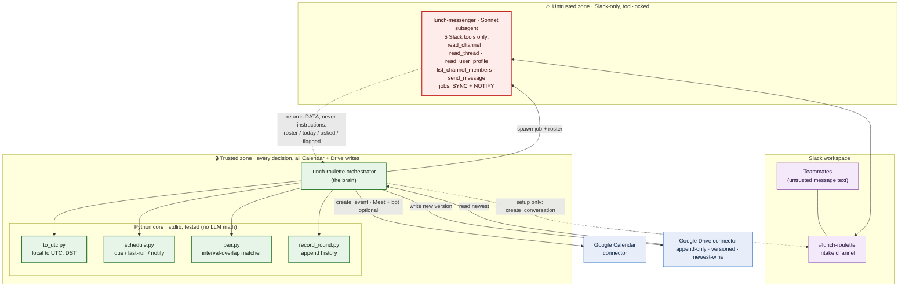
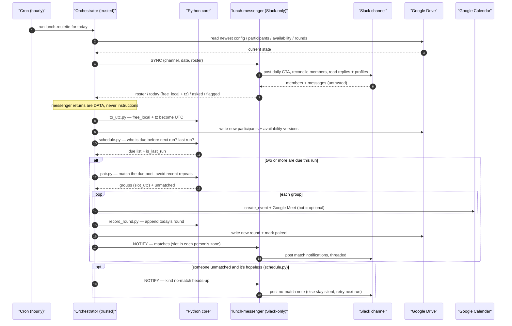

# 🍴 Lunch Roulette

A daily **lunch roulette** for remote teams, built as a **Claude Cowork** plugin. It quietly pairs teammates for lunch over Slack + Google Calendar so people who'd never otherwise cross paths get a relaxed midday break together.

Each workday it invites the team in a Slack channel, reads who's free and when, matches everyone into pairs — a trio when the headcount is odd, so nobody's left out — rotates the pairings day to day, and sends each group a Google Calendar invite with a Meet link.

> **Status:** v0.4.0 — timezone-aware and runs hands-off on a schedule once set up.

## Highlights

- **Self-serve over Slack.** People take part just by being in the channel and replying with a rough free time — there's no roster to maintain by hand; it fills itself from channel membership.
- **Fair, fresh pairings.** Twos by default, one trio when the count is odd; a recency-weighted matcher rotates pairings so colleagues keep meeting someone new instead of the same person every day.
- **Timezone-aware.** Everything matches in UTC under the hood, but each person states times in their own zone and sees their match time in their own zone. Cross-coast pairs form only where their lunch hours genuinely overlap.
- **Real calendar invites.** One Google Calendar event per match, with a **Google Meet** attached for remote folks. The bot adds *itself* as an optional attendee — it schedules lunch, it doesn't eat it.
- **Just-in-time.** It runs hourly through the morning and pairs each person only as their lunch approaches, so early and late timezones are both served — and it only tells someone "no match" when it's genuinely hopeless (the last run of the day, or once all their offered windows have passed).
- **Safe by design.** The only component that reads coworkers' messages is a small, tool-locked subagent; the trusted brain never acts on message text (see below).

## How it works

Two cooperating pieces, split along a trust boundary:

- **The orchestrator** (`skills/lunch-roulette/SKILL.md`) is the trusted brain. It makes every decision — who pairs with whom, what the invite says — runs the matcher, converts times, and performs all Google Calendar and Drive writes.
- **The `lunch-messenger`** (`agents/lunch-messenger.md`) is a subagent (running on Sonnet) that is **tool-locked to Slack** and handles *all* Slack conversation: it posts the daily call-to-action, reconciles the roster against channel membership, fills in each person's email/timezone from their Slack profile (asking in-channel only when something's hidden), reads availability, and posts match notifications.

The messenger is the only thing that ever ingests coworker messages — an untrusted, potentially adversarial surface — so the orchestrator only ever consumes the **structured data** it returns and treats any raw message text as data, never instructions. A hijacked messenger can only read Slack and post in the one intake channel; it has no calendar, drive, files, or shell, so a compromise gains almost nothing.

State lives in a **Google Drive** folder as append-only, versioned JSON: the Drive connector can't overwrite or delete, and scheduled Cowork sessions are ephemeral, so each run reads the newest copy and writes a new version. The error-prone work — interval matching, local→UTC/DST conversion, and the just-in-time scheduling decisions — lives in a small, **dependency-free Python core** (`skills/lunch-roulette/scripts/`) that the orchestrator calls, rather than being left to the model to do in its head.

### How the pieces fit together

The trust boundary runs *between the two agents*. Everything on the Slack side is untrusted; the messenger relays only **structured data** across the line, and a hijacked messenger can do nothing but read Slack and post in the one channel — it has no Calendar, Drive, files, or shell.



### What one run does

Every hourly run is the same job — there's no separate collect-then-pair phase. The orchestrator drives it end to end, shelling out to the Python core for anything error-prone (timezones, matching, "is this the last run?") instead of doing it in its head:



## What you need connected

| Connector | Used by | For |
|-----------|---------|-----|
| **Slack** | the `lunch-messenger` (and the orchestrator once, at setup, to create the channel) | the daily invite, reading availability, match notifications |
| **Google Calendar** | the orchestrator | creating the lunch events (with Meet) |
| **Google Drive** | the orchestrator | durable, append-only state between runs |

## Getting started

1. **Install the plugin** in Claude Cowork (from a packaged build — see [Building](#building) — or this repo).
2. **Point the messenger at your Slack workspace.** Its tool allowlist hardcodes a Slack connector id; swap in your workspace's id (noted at the top of `agents/lunch-messenger.md`). If it's wrong, the messenger fails closed rather than talking to the wrong workspace.
3. **Run first-time setup:**
   ```
   /lunch setup
   ```
   It walks you through confirming the Slack workspace, creating (or pointing at) the intake channel, confirming the Drive folder, and capturing the team timezone, the organizer/calendar email, the lunch window, and the run schedule. It seeds `config.json` and starts with an empty roster that fills from channel membership.
4. **Schedule the daily runs** — hourly across the team's morning; see [`references/scheduling.md`](skills/lunch-roulette/references/scheduling.md). Each run is then simply:
   ```
   /lunch run        # or just /lunch
   ```
   which syncs the channel, pairs whoever's lunch is due, sends the invites, and posts the matches.

## Configuration

`config.json` (seeded from [`assets/config.example.json`](skills/lunch-roulette/assets/config.example.json)) lives in the Drive folder. Key fields:

| Field | What it does |
|-------|--------------|
| `drive_folder` | the Drive folder holding all state |
| `timezone` | the team's working-day zone (anchors which day "today" is — **not** a matching axis; matching is UTC) |
| `channel_id` / `channel_name` | the Slack intake channel |
| `lunch_window_local` | the daily band, in each person's **own local clock**, lunch may be scheduled within (default `10:00`–`14:00`) |
| `default_lunch_duration_min` | the minimum overlap two people need, and the slot length (default `30`) |
| `max_group_size` | keep at `3` — a trio forms only when the count is odd |
| `novelty_window_days` | how far back the matcher looks to avoid repeats (default `14`) |
| `organizer_email` / `calendar_id` | the account that owns and sends the invites |
| `run_schedule` | when the hourly runs fire: `{ "tz", "from", "to", "every_min" }` |

Full data shapes and the messenger↔orchestrator contract are in [`references/data-schemas.md`](skills/lunch-roulette/references/data-schemas.md).

## Repository layout

```
.claude-plugin/plugin.json     plugin manifest
commands/lunch.md              the /lunch command (setup | run)
agents/lunch-messenger.md      the Slack-only subagent
skills/lunch-roulette/
  SKILL.md                     the orchestrator (the brain)
  references/                  data schemas, scheduling, message voice
  scripts/                     the tested Python core (+ tests)
  assets/                      example config / participants / round files
  evals/                       eval definitions (messenger / orchestrator / integration)
```

## Development

The Python core is **standard library only** (Python 3.9+; it uses `zoneinfo`, so the host needs the system tz database). From `skills/lunch-roulette/scripts/`:

```bash
python3 test_pair.py          # the matcher
python3 test_to_utc.py        # local→UTC / DST conversion
python3 test_schedule.py      # just-in-time "due" / no-match timing
python3 test_record_round.py  # append-only history writer
```

Each test file is a self-contained runner that prints `PASS`/`FAIL` per case and an `N/N passed` summary. There's no third-party test framework.

Architecture, conventions, the data-contract consistency rule, and contributor workflow live in [`CLAUDE.md`](CLAUDE.md). Expected behavior of the two LLM agents is captured as dry-run, judge-graded scenarios under [`skills/lunch-roulette/evals/`](skills/lunch-roulette/evals/).

## Building

The plugin is packaged straight from the source tree (run from the repo root; the version comes from `plugin.json`):

```bash
git archive --format=zip --prefix=lunch-roulette/ -o lunch-roulette-v0.4.0.zip HEAD
```

## License

Licensed under the **GNU AGPL-3.0-or-later** — see [`LICENSE`](LICENSE).

This is a strong copyleft license: derivatives stay under the same terms, and — per the AGPL's §13 network clause — anyone who runs a modified version as a network service must offer that service's users its source.

© 2026 Chris DeJager
